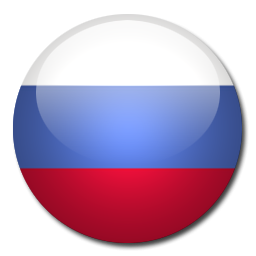
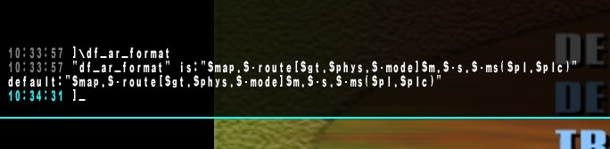
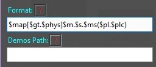
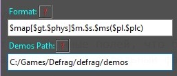
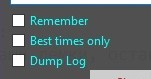

# Defrag Demos Сleaner

Software was meant for helping in managing your defrag's demos folder easily.  
Sometimes it gets *really messy* there and could cause lags if no action was taken in time.  
With **DDCleaner** your demos managment will narrow down to **few clicks**!  

## HOW TO USE [/]

  

***ENG:***  
Enter defrag's "**df_ar_format**" variable value (just type "df_ar_format" in console) in "**Format**" field,  
but make sure there are only tokens, which listed below:  
**$map | $gt | $phys | $m | $s | $ms | $pl | $plc**  
Also remove any **"+" and "-"** symbols, which were used in combination with them.  

Make sure **all tokens** are separated with some kind of symbol, for examle "**.**", but it can't be "**$**",  
as well as being placed as the first or last character.

***RU:***  
Введите в поле "**Format**" значение, присвоенное переменной дефрага "**df_ar_format**"  
(узнать можно просто написав "df_ar_format" в консоли дефрага)  
предварительно убрав все токены, которых нету в следующем списке:  
**$map | $gt | $phys | $m | $s | $ms | $pl | $plc**
Также уберите все знаки **"+" и "-"**, используемые в них.

Удостовертесь, что **все токены** разделены между собой каким-то символом, например "**.**" (но не "**$**"),  
а также в отсутствии их в начале и конце.

  

***ENG:***  
**EXAMPLE:** If value of "**df_ar_format**" is "*$map.$-route[$gt.$phys.$-mode]$m.$-s.$-ms($pl.$plc)*",  
then you should put "**$map[$gt.$phys]$m.$s.$ms($pl.$plc)**" as a value in "**Format**" field.  
It **MUST** contain at least all those tokkens: **$map | $phys | $m | $s | $ms | $pl**  
   
***RU:***  
**ПРИМЕР:** Если значение "**df_ar_format**" = "*$map.$-route[$gt.$phys.$-mode]$m.$-s.$-ms($pl.$plc)*",
тогда в поле "**Format**" введите "**$map[$gt.$phys]$m.$s.$ms($pl.$plc)**".
В значении **ОБЯЗАТЕЛЬНО** должны присутствовать следующие токены: **$map | $phys | $m | $s | $ms | $pl**

  

***ENG:***  
In "**Demos Path**" enter absolute path to your defrag's "**demos**" folder.  
**EXAMPLE:** "*C:/Games/Defrag/defrag/demos*"  

***RU:***  
В поле "**Demos Path**" введите полный путь до вашей папки "**demos**" дефрага  
**ПРИМЕР:** "*C:/Games/Defrag/defrag/demos*"  

#### ***You're ready to go! almost.. | Теперь вы знаете все! ну почти..***  

## Features | Полезные фичи
  

* Remember: 
  *  Saves your fields data, so later, after program startup you wouldn't bother yourself filling them again. 
  *  Сохраняет ваши данные полей, что бы при запуске программы они заполнялись автоматически. 
  
* Best times only:
  *  Cleans your demos, leaving only best times in each physics for each map.
  *  Чистит ваши демки, оставляя в каждой из физик для каждой карты лишь демки с лучшим временем.
* Dump Log:
  *  Dumps next console's session into .log file.
  *  Сохраняет в файл log консоли последующей отчистки.
